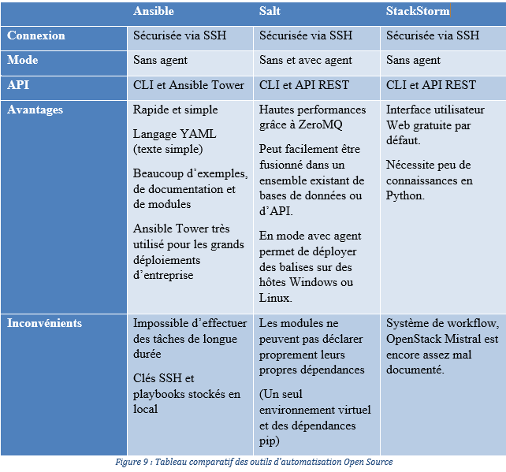
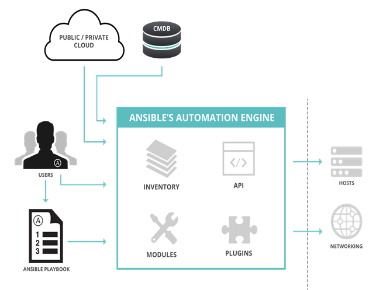
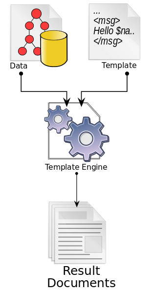

# Important

Le fichier suivant contient des informations utiles pour mieux comprendre l'arborescence et avoir une aperçu du contenu des répertoires et fichiers. 

[Informations utiles](https://github.com/Bantou96/automatisation-reseau-avec-ansible/blob/master/informations-utiles.md)

Vous pouvez y jeter un coup d'oeil 

[Informations utiles](https://github.com/Bantou96/automatisation-reseau-avec-ansible/blob/master/informations-utiles.md)

# Automatisation réseau

Quand on est responsable d’un réseau d’entreprise, on sait probablement que de nombreuses opérations manuelles sont effectuées via l’interface de ligne de commande (CLI). Il n’est pas surprenant que le principal défi que rencontrent des utilisateurs en matière de réseau consiste à améliorer leur agilité.

Etant jeune ingénieur en sécurité des systèmes et des communications, j'ai très vite compris qu'avoir des compétences en scripting rendrait les tâches d'administration moins fastidieuses surtout lorsqu'on évolue dans une entreprise avec un parc informatique très vaste.

L'objectif est de répondre au besoin d'automatisation et donc de simplification des tâches de configurations réseaux (création, suppression et modification).
J'ai essentiellement travaillé sur la partie automatisation de la configuration des équipements réseaux particulièrement ceux de Cisco. 

Les logiciels d'automatisation sont aujourd'hui de plus en plus utilisés car elles comportent des modules réseaux permettant de configurer toute la pile d'equipements niveau 2 et 3, de tester et de valider les changements apportés. 

## Choix de l'outil d'automatisation
Au niveau le plus basique, il est possible d'automatiser les composants réseau à l'aide de commandes et d'arguments de ligne de commande standard. Par exemple, on peut utiliser les opérateurs BASH pour créer des chaînes d'événements selon que la commande précédente a réussi (&&) ou échoué (||). Nous pouvons aussi compiler des listes de commandes dans des fichiers texte (aussi appelés scripts Shell), qui peuvent être exécutés de manière répétée et simultanée en une seule commande.

Les outils d’automatisation open source Ansible, Salt et StackStorm peuvent être utilisés pour automatiser les périphériques réseau. 

l’utilisation d’un outil qui implique l’installation de modules sur chaque équipement de notre réseau serait encore plus fastidieuse et rendrait l’idée d’automatisation très compliquée. Cette problématique m’a permis de réfléchir d’abord sur le choix d'un outil **sans agent**.

Pour la suite de cette aventure sur l'automatisation réseau nous allons travaillé avec l'outil Ansible qui a l'avantage d'avoir une grande communauté, une documentation assez fournie et un langage **YAML** qui est tout simplement du texte. 

Cool non !!!

## Présentation de l'outil Ansible
**Un peu d'histoire**

Une « ansible » est un dispositif théorique permettant de réaliser des communications à une vitesse supraluminique (supérieure à la vitesse de la lumière) imaginé en 1966 par Ursula K. Le Guin dans son roman de science-fiction, Le Monde de Rocanon.  

Parmi les outils d’automatisation des configurations et des déploiements, Ansible fait partie des plus populaires. Il a été conçu par un ancien employé Red Hat, Michael DeHaan, également auteur de l’application de serveur de « provisionning » Cobbler et co-acteur du framework Func pour l’administration à distance. Red Hat a racheté la société Ansible,Inc en octobre 2015. 

Ansible permet de faire de l’infrastructure un code et est disponible sous licence GPL v3 (GNU General Public Version 3.0), il s’adosse au protocole d’authentification réseau sécurisée (SSH) pour déployer les mises en production de code via des fichiers décrivant les configurations à appliquer aux équipements.  
Il répond aux besoins des Admin système / Cloud, aux admins de stockage pour une automatisation des serveurs, du réseau et du stockage. 

## Fonctionnement

Ansible fonctionne sur de nombreux systèmes de type Unix, et peut configurer aussi bien des systèmes de type Unix que Microsoft Windows. L’outil est sans agent car il n’est pas nécessaire d’installer des logiciels supplémentaires sur les nœuds secondaires. Il faut juste qu’Ansible puisse se connecter temporairement à distance via **SSH** ou **Windows Remote Management** (permettant l’exécution à distance de PowerShell) pour effectuer ses tâches. 
Ansible gère les différents équipements avec un accès à distance natif (tels que les protocoles cités ci-dessus) et il comprend son propre langage déclaratif pour décrire la configuration du système. Il offre des capacités de parallélisation, collecte de métadonnées et gestion des états. L’aspect de conception « agentless » installé sur le périphérique est important car il réduit les besoins d’infrastructure pour démarrer une gestion. 
Les modules fonctionnent grâce à **JSON** en sortie standard et peuvent être écrits dans n’importe quel langage de programmation. Le système utilise notamment **YAML** pour exprimer des descriptions réutilisables et traite les variables grâce à des modèles Jinja2.  
Manipuler Ansible consiste à écrire du texte géré sous forme de code informatique. En vue de contrôler des nœuds distants, des utilisateurs lancent des **« playbooks »** (livres de jeu) à partir d’un nœud de contrôle grâce à Ansible Engine.

Ansible Engine utilise différents composants comme :
-	Des modules 
-	Des plugins
-	Un API
-	Un inventaire 
-	Des collections

## Définition des termes

- **Les modules**

Les modules sont “les outils dans la boîte-à-outils”.
Ansible fonctionne en se connectant aux nœuds à gérer et en leur envoyant des petits programmes, appelés “modules Ansible”. Ces programmes sont écrits pour être des modèles de ressources de l’état souhaité du système. Ansible exécute ensuite ces modules (via SSH par défaut) grâce au protocole JSON sur la sortie standard et les supprime lorsque l’action est terminée.
La bibliothèque de modules peut résider sur n’importe quelle machine et sans aucun serveur central, démon ou base de données. Rien n’interdit d’écrire son propre module. Ces modules peuvent contrôler les ressources comme des services, des paquets ou des fichiers (n’importe quoi en réalité), ou encore exécuter des commandes système.

- **Les plugins de connexion**

Les plug-ins de connexion permettent à Ansible de se connecter aux hôtes cibles afin d’exécuter des tâches sur ceux-ci. Ansible est livré avec de nombreux plugins de connexion, mais un seul peut être utilisé par hôte à la fois. Les plus utilisés sont les types de connexion Paramiko SSH, SSH natif (appelé simplement SSH) et local. 

- **Les collections**

Les collections sont un format de distribution pour du contenu Ansible qui peut inclure des livres de jeu, des rôles, des modules et des plugins. Les collections sont distribuées par Ansible Galaxy. 

- **L’inventaire**

Pour démarrer une gestion Ansible, on a besoin d’un inventaire. Par défaut, Ansible représente les machines qu’il gère à l’aide d’un fichier INI très simple qui place toutes les machines gérées dans des groupes de notre choix. Une fois que les hôtes d’inventaire sont répertoriés, des variables portant sur les cibles de gestion, peuvent leur être attribuées dans des fichiers texte simples. 

Un jeu est une analogie sportive qui définit un état ou un modèle.

Chaque livre de jeu est composé d’une ou plusieurs “séances de jeu (plays)” exposés sous forme d’une liste.
Un “livre de jeu” organise des tâches en jeux. Le module quant à lui permet d'exécuter une serie d'actions.
Mais il serait une bonne pratique de l’organiser en rôles. Un rôle ajoute un niveau d’abstraction dans l’exécution des tâches d’un livre de jeu. 

## Exécution des tâches

Dans la partie exécution des tâches nous avons d’autres termes qui sont utilisés.
Une tâche est l’appel à un module Ansible. Le module Ansible contient localement tout le code utile à l’exécution. Il est donc important de disposer du code à jour des modules et de pouvoir exécuter du code python car c’est le langage qui est utilisé en background au niveau du nœud principal dans notre cas puisqu’on agit sur des équipements réseaux. 

Il existe deux principaux modes d’exécution des tâches avec Ansible :

- **Le mode Ad-Hoc**

Il permet l’exécution de tâches parallèles. Dès qu’une instance est disponible, on peut lui parler immédiatement, sans aucune configuration supplémentaire. Un accès à des modules de ressources basés sur des états, ainsi qu’à des commandes brutes est disponible. Ces modules sont assez faciles à écrire.

- **Les Playbooks (Livres de jeu)**

Les livres de jeu (playbooks) sont écrits selon un langage d’automatisation simple et puissant. Les livres de jeu peuvent orchestrer avec précision plusieurs parties d’une topologie d’infrastructure, avec un contrôle très détaillé du nombre de machines à traiter à la fois.
Les livres de jeu sont écrits en langage YAML, Ain’t Markup Language. YAML expose un minimum de syntaxe et propose un modèle de configuration ou de processus plutôt qu’un langage de script ou de programmation.

J’ai pratiquement utilisé que le mode d’exécution Playbooks dans la phase implémentation de la solution. 

## La mise en forme des données 

Ansible intègre nativement le « template engine » Jinja2 qui est un logiciel permettant de mettre en forme les données. Le principe est de créer des rapports et des documents à partir des mêmes sources de données. 
Ci-après le schéma qui illustre le fonctionnement des modèles Jinja2

Les modèles de données sont transformés en configuration de périphériques et les sorties de périphériques peuvent être transformées en documentation. Le modèle permet aux utilisateurs de manipuler les variables, d’y appliquer une logique conditionnelle et répétitive et donc d’étendre la programmation dans l’automatisation du réseau. 

# A lire 

[Informations utiles](https://github.com/Bantou96/automatisation-reseau-avec-ansible/blob/master/informations-utiles.md)
